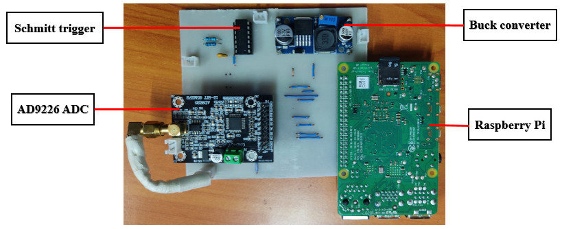
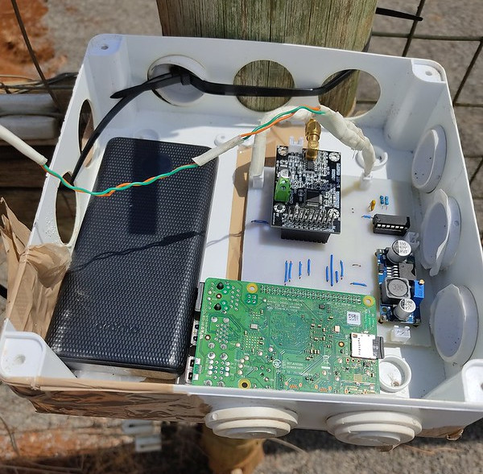
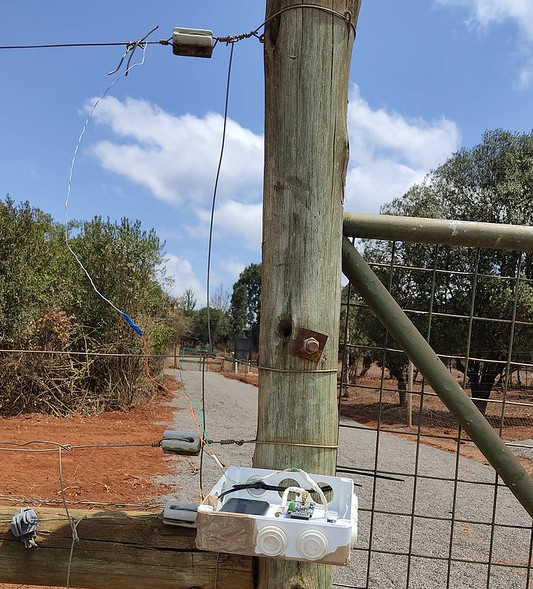
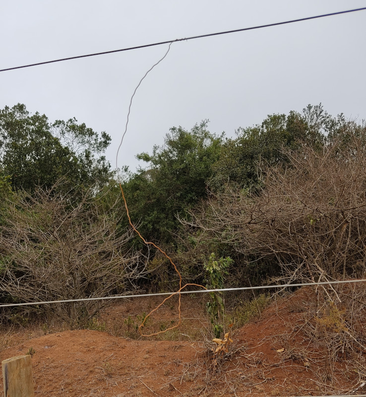

# Electric Fence Fault Detector and Localiser

Electric fences are used to establish protected areas (PAs), in agriculture, installations requiring enhanced security like military installations and homes. These fences are prone to faults that affect their effectiveness. Fences used in PAs, especially, are very long. Manual inspection of these fences when faults occur is labour intensive, time consuming and inefficient. In this project, we have developed a cheap device to remotely monitor electric fences and help in detecting and localising faults in them. The device employs the concept of **Time Domain Reflectometry (TDR)**. TDR involves sending a pulse down a cable and analysing the reflected signal to detect faults, determine the type of faults and their point of occurrence. The device is based on the Raspberry Pi single board computer. The main components that comprise the system are:
1. The Raspberry Pi
2. An ultrafast analogue to digital converter (ADC)
3. A pulse (a Schmitt trigger pulse) generator

A TDR Electric Fence Fault Detector and Localiser has been fabricated on a printed circuit board as shown in Figure 1 below.


<p align="center">
   
</p>

<p align="center"> 
  <em>Figure 1: A TDR Electric Fence Fault Detector and Localiser</em>
</p>

Sections of the [Dedan Kimathi University of Technology Wildlife Conservancy (DeKUTWC)](https://conservancy.dkut.ac.ke/) and [Ol Pejeta Consrvancy](https://www.olpejetaconservancy.org/) electric fences were used to simulate open circuit and short circuit faults. Using the TDR system, a step-signal was applied to the fence and sampled at the input.

<p align="center">
   
</p>

<p align="center"> 
  <em>Figure 2: TDR system in an adapter box</em>
</p>


<p align="center">
   
</p>

<p align="center"> 
  <em>Figure 3: TDR system connected to the electric fence</em>
</p>


<p align="center">
   
</p>

<p align="center"> 
  <em>Figure 4: A simulation of a short circuit</em>
</p>

The sampled signals were saved for analysis. The method of change point detection was used to analyse the signal to detect reflected signals on the sampled signals. To run the code programs on the Raspberry Pi, run the following commands on terminal.

 ```cpp
cd electric-fence-fault-detector-and-localiser
```

Run the following command once i.e., only during setup.

```cpp
./raspi-update.sh
```
The Raspberry Pi will reboot after updating. Run the following command after it has rebooted.

```cpp
./raspi-env-setup.sh
```

Finally, run the following command:

```cpp
source tdr-env/bin/activate
```

```cpp
python tdr.py
```
