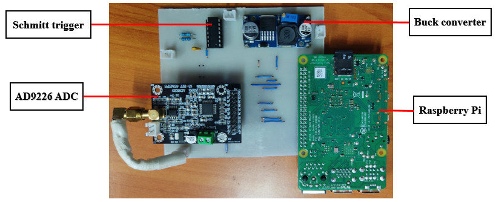
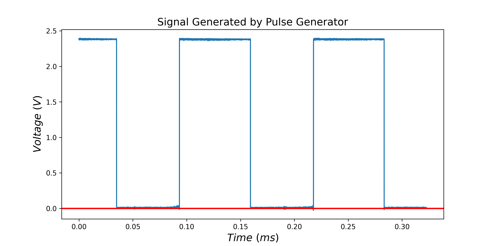

# Fast Data Capture Using the Raspberry Pi 4

The code contained in this directory is used to sample data at very high speed (31 MSPS) using the Raspberry Pi 4 and the AD9226 Analogue to Digital Converter (ADC).
The work has been adapted from this project [here](https://iosoft.blog/2020/07/16/raspberry-pi-smi/). The ADC is interfaced with the Raspberry Pi using the Secondary
Memory Interface (SMI). SMI is a parallel interface found in all Raspberry Pi versions. The SMI (parallel) interface is the fastest interface since all data bits are
transferred from a peripheral device using a single clock cycle. Once the data is captured, it is transferred to memory using Direct Memory Access (DMA). DMA is a 
method of transferring data around a computer at high speeds. DMA operates independent of the CPU and, hence, is free from jitter due to interruption of the CPU by 
high priority tasks. To learn more and how to interface the AD9226 with the Raspberry Pi, use this [link](https://iosoft.blog/2020/07/16/raspberry-pi-smi/).

At the [Centre for Data Science and Artificial Intelligence (DSAIL)](https://dekut-dsail.github.io/), a Time Domain Reflectometer (TDR) based on the Raspberry Pi
and the AD9226 ADC has been developed. The system will be used to detect and localise faults in electric fences. Figure 1 below shows the TDR and Figure 2 shows 
a 8.3 kHz rectangular signal generated and sampled by the TDR at 31 MSPS.

<p align="center">
   
</p>

<p align="center"> 
  <em>Figure 1: A TDR Electric Fence Fault Detector and Localiser</em>
</p>


<p align="center">
   
</p>

<p align="center"> 
  <em>Figure 2: An 8.3 kHz rectangular signal generated and sampled by the TDR at 31 MSPS</em>
</p>

For farther information on the TDR design, use this [link](https://github.com/DeKUT-DSAIL/hardware-designs/tree/main/electric-fence-fault-detector-and-localiser). To run this code, clone this repository into the Raspberry Pi and run the following commands on the Raspberry Pi terminal:

```cpp
source tdr-env/bin/activate
```

 ```cpp
cd electric-fence-fault-detector-and-localiser/fast-data-capture-with-raspberry-pi4
```

```cpp
chmod +x sample.sh
```

```cpp
chmod +x test.sh
```

```cpp
gcc -Wall -pedantic -o adc adc.c dma_utils.c -fcommon
```

Run the following command once i.e., only during setup.


Finally, run the following command:

```cpp
./test.sh
```
